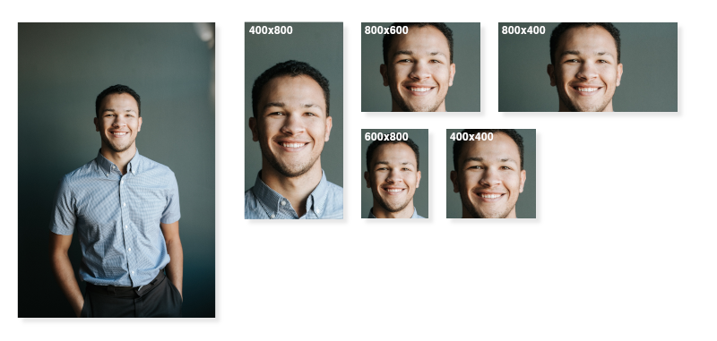
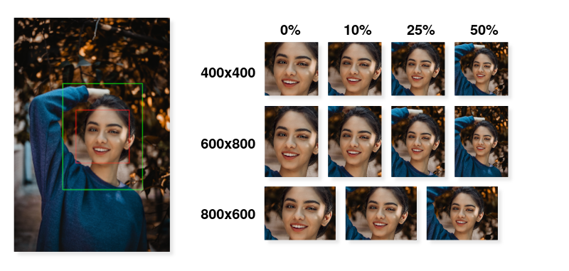

# Passphoto

Passphoto is a small cli program that detects faces in a given image file and crops them to an output directory.

# Usage
```bash
$ passphoto ./photo.jpg

--> creates cropped image: ./photo_cropped.jpg
```

## All Options
```
  -d [ --dimensions ] arg  Set output image dimensions [w]x[h] (default 600x800)
  -s [ --suffix ] arg      Set output filename suffix (default 'cropped')
  -t [ --type ] arg        Set output file type - JPG or PNG (default JPG)
  -c [ --cascade ] arg     OpenCV cascade file
                           (default: "/usr/local/share/[..]/haarcascade_frontalface_alt.xml")
  -p [ --padding ] arg     Percent padding relative to face size (default 10)
  -m [ --multi ]           Allow multiple faces to be cropped
  -i [ --input-file ] arg  Path to original image file
  -o [ --output-path ] arg Path to output cropped images
  -j [ --json ]            JSON Output
  -k [ --validate ]        Check that a valid face is in the file without cropping
  -v [ --version ]         Show version
  --debug                  Output debug images showing face and crop bounds
  -h [ --help ]            This help message
```


## Examples

### Crop single face from photo

The default output resolution is `600x800` portrait.

By default the output image will be saved with the `cropped` suffix, so in this case the filename for the cropped image will be `./examples/photo_cropped.jpg`

> **Note** If there are multiple faces in the photo the largest detected face will be used.

```bash
$ passphoto ./examples/photo.jpg
--> creates ./examples/photo_cropped.jpg
```
---

### Set output directory

By default your cropped images will save in the same directory as the input file. To output to a different directory you can use `-o` or `--output-path`. If the directory does not exist it will be created for you.

```bash
$ passphoto -o ./cropped/ ./examples/photo.jpg
--> creates ./cropped/photo_passphoto.jpg
```
---

### Set dimensions for output image

Set output image dimensions using `-d [w]x[h]` or `--dimensions [w]x[h]`

```bash
$ passphoto -d 400x800 ./examples/photo.jpg
$ passphoto -d 800x600 ./examples/photo.jpg
$ passphoto -d 800x400 ./examples/photo.jpg
$ passphoto -d 600x800 ./examples/photo.jpg
$ passphoto -d 400x400 ./examples/photo.jpg
```



<sup><i> Photo Credit: [Ben Parker](https://unsplash.com/@brokenlenscap) </i></sup>

---

### Quickly check if an image contains a valid face
> **Note** This does not not write any files

If you want to simply ensure that an image contains a valid face that meets your specifications without saving cropped files, you can use `-k` or `--validate`. 

Passphoto will return an exit code of `0` if it detects at least one valid face, and an exit code of `1` if no faces are found.

This can also be used in conjunction with [JSON output](#terminal-output-as-json), which is useful, for example, when using Passphoto with a web frontend.

```bash
$ passphoto -k ./examples/photo.jpg
--> returns exit code 0 - at least one face was found

$ passphoto -k ./examples/apple.jpg
--> returns exit code 1 - no face was found

$ passphoto -k ./examples/multiple.jpg
--> returns exit code 0 - at least one face was found

$ passphoto -p 200 -k ./examples/photo.jpg
--> returns exit code 1 - the 200% padding value makes the face invalid due 
                          to the requested crop overflowing the image bounds
```
---

### Set suffix for cropped image filenames

By default the cropped image saves using the same filename as the input image with `_cropped` appended, so with the input file `photo.jpg` the output will be `photo_cropped.jpg`. You can change this suffix using the `-s` or `--suffix` option.

```bash
$ passphoto -s passphoto ./examples/photo.jpg
--> creates ./examples/photo_passphoto.jpg

$ passphoto -s face ./examples/photo.jpg
--> creates ./examples/photo_face.jpg

$ passphoto -s profile_photo -o ./cropped/ ./examples/photo.jpg
--> creates ./cropped/photo_profile_photo.jpg
```
---

### Set output file type

Cropped images can be output in `jpg` and `png` by setting `-t` or `--type`. The default output is `jpg`.

```bash
$ passphoto -t jpg -o ./cropped/ ./examples/photo.jpg
--> creates ./cropped/photo_cropped.jpg

$ passphoto -t png -o ./cropped/ ./examples/photo.jpg
--> creates ./cropped/photo_cropped.png

$ passphoto -t jpg -o ./cropped/ ./examples/photo.png
--> creates ./cropped/photo_cropped.jpg
```
---

### Set crop padding

Faces detected with the default cascade are aproximately hairline to chin, ear to ear. Without additional padding it creates a tight crop at the face boundaries. The default padding of 10% typically produces a nice result, but it can be changed using `-p` or `--padding`.

The padding value relates to the percentage of the width or height of the face boundaries. When using `-p 10` for example, 10% of the width of the face will be padded on all sides.

The aspect ratio of the [output image dimensions](#set-dimensions-for-output-image) will be maintained, so with a tall portrait aspect ratio you will end up with more padding above and below the face, but to the left and right there will always be the minimum specified padding. Likewise, with a landscape aspect ratio there will be more padding on the sides while the top and bottom maintain the minimum.

> **Note** If the padding is set too high images containing faces near the edge of a photo may fail due to the crop falling outside of the input image boundaries.

```bash
$ passphoto -p 0 -o ./cropped/ ./examples/photo.png
--> creates ./cropped/photo_cropped.jpg - no padding

$ passphoto -p 10 -o ./cropped/ ./examples/photo.jpg
--> creates ./cropped/photo_cropped.jpg - 10% padding 

$ passphoto -p 25 -o ./cropped/ ./examples/photo.jpg
--> creates ./cropped/photo_cropped.jpg - 25% padding 

$ passphoto -p 50 -o ./cropped/ ./examples/photo.jpg
--> creates ./cropped/photo_cropped.jpg - 50% padding 

$ passphoto -p 25 -c 800x600 -o ./cropped/ ./examples/photo.jpg
--> creates ./cropped/photo_cropped.jpg - 25% padding landscape 
```



<sup><i> Photo Credit: [Omid Armin](https://unsplash.com/@omidarmin) </i></sup>

---

### Detecting and cropping multiple faces in single image

By default Passphoto will choose the single largest face in an image, but it is also able to detect and crop multiple faces using `-m` or `--multi`. 

Each cropped file that is output will be appended with the index of the face, for example `photo_0.jpg`, `photo_1.jpg`, etc.

> **Note** if only one face is found while using `-m` the output image will still have index of 0 appended to maintain consistency.
```bash
$ passphoto -m -o ./cropped/ ./examples/photo.png
--> three faces were found in image
--> created image ./cropped/photo_cropped_0.jpg
--> created image ./cropped/photo_cropped_1.jpg
--> created image ./cropped/photo_cropped_2.jpg

$ passphoto -m -o ./cropped/ ./examples/photo.png
--> only one face was found in image
--> created image ./cropped/photo_cropped_0.jpg
```
---

### Terminal output format

By default information about the detected images and resulting crop will be output to `stdout` in a standard multiline format with the following properties:

`faces_found`: number of faces that were found in images

`faces_cropped`: number of faces that were cropped and output to file (will be 1 if not [outputting multiple](#detecting-and-cropping-multiple-faces-in-single-image))

`cropped_file[n]`: path of cropped file where `n` is the index of the face being cropped. (useful when [outputting multiple faces](#detecting-and-cropping-multiple-faces-in-single-image))

`debug_file`: _(optional)_ path to [debug file](#output-debug-file)

`face_bounds[n]_x`: x position of detected face boundary at index `n` in px

`face_bounds[n]_y`: y position of detected face boundary at index `n` in px

`face_bounds[n]_width`: width of detected face boundary at index `n` in px

`face_bounds[n]_height`: height of detected face boundary at index `n` in px

`crop_bounds[n]_x` x position of cropped file for face at index `n` in px

`crop_bounds[n]_y`: y position of cropped file for face at index `n` in px

`crop_bounds[n]_width`: width of cropped file for face at index `n` in px

`crop_bounds[n]_height`: height of cropped file for face at index `n` in px


```bash
$ passphoto -o ./cropped/ ./examples/photo.png

faces_found: 1
faces_cropped: 1
cropped_file[0]: [full path]/cropped/photo.png
face_bounds[0]_x: 1592
face_bounds[0]_y: 2367
face_bounds[0]_width: 1363
face_bounds[0]_height: 1363
crop_bounds[0]_x: 911
crop_bounds[0]_y: 1232
crop_bounds[0]_width: 2725
crop_bounds[0]_height: 3633


$ passphoto -m -o ./cropped/ ./examples/photo.png

faces_found: 4
faces_cropped: 4
cropped_file[0]: [full path]/cropped/photo_cropped_0.jpg
cropped_file[1]: [full path]/cropped/photo_cropped_1.jpg
cropped_file[2]: [full path]/cropped/photo_cropped_2.jpg
cropped_file[3]: [full path]/cropped/photo_cropped_3.jpg
face_bounds[0]_x: 1898
face_bounds[0]_y: 284
face_bounds[0]_width: 288
face_bounds[0]_height: 288
crop_bounds[0]_x: 1870
crop_bounds[0]_y: 198
crop_bounds[0]_width: 344
crop_bounds[0]_height: 460
face_bounds[1]_x: 425
face_bounds[1]_y: 301
face_bounds[1]_width: 285
face_bounds[1]_height: 285
crop_bounds[1]_x: 397
crop_bounds[1]_y: 216
crop_bounds[1]_width: 341
crop_bounds[1]_height: 456
[...]
```

#### Error Info

Error info is returned to stderr and the exit code will be non-zero.

The error info format is `[error code]: [message]` where `[error code]` is one of
`CROP_ERROR`,
`NO_FACES`,
`FILE_ERROR`,
`PATH_ERROR`,
`OPENCV_ERROR`,
`CASCADE_ERROR`, or
`DIMENSION_ERROR` 
(see [src/ErrorTypes.h](./passphoto/blob/master/src/ErrorTypes.h))

```bash
$ passphoto -m -o ./cropped/ ./examples/photo.png
NO_FACES: No faces found in image

$ passphoto -m -o ./cropped/ ./examples/photo.png
CROP_ERROR: Face not within crop bounds
```
---

### Terminal output as JSON

Output information can be returned in JSON format using `-j` or `--json`.

The JSON format mirrors the [Terminal output format](#terminal-output-format) but uses JSON objects in place of the pseudo-arrays.

#### Crop single face
```bash
$ passphoto -j -o ./cropped/ ./examples/photo.png

{
    "faces_found": "1",
    "faces_cropped": "1",
    "cropped_images": {
        "0": "[full path]/cropped/photo_cropped.jpg"
    },
    "bounds": {
        "0": {
            "face": {
                "x": "824",
                "y": "809",
                "width": "832",
                "height": "832"
            },
            "crop": {
                "x": "741",
                "y": "561",
                "width": "998",
                "height": "1329"
            }
        }
    }
}
```

#### Crop multiple faces (include [debug file](#create-debug-file))
```bash
$ passphoto --debug -m -j -o ./cropped/ ./examples/photo.png

{
    "faces_found": "4",
    "faces_cropped": "4",
    "cropped_images": {
        "0": "[full path]]\/output\/photo_cropped_0.jpg",
        "1": "[full path]]\/output\/photo_cropped_1.jpg",
        "2": "[full path]]\/output\/photo_cropped_2.jpg",
        "3": "[full path]]\/output\/photo_cropped_3.jpg"
    },
    "bounds": {
        "0": {
            "face": {
                "x": "1898",
                "y": "284",
                "width": "288",
                "height": "288"
            },
            "crop": {
                "x": "1870",
                "y": "198",
                "width": "344",
                "height": "460"
            }
        },
        "1": {
            "face": {
                "x": "425",
                "y": "301",
                "width": "285",
                "height": "285"
            },
            "crop": {
                "x": "397",
                "y": "216",
                "width": "341",
                "height": "456"
            }
        },
        [...]
    },
    "debug_file": "[full path]]\/output\/photo_cropped_debug.jpg"
}
```

#### Verify image contains face
```bash
$ passphoto -m -j -k ./examples/photo.png

{
    "faces_found": "4",
    "faces_cropped": "0",
    "bounds": {
        "0": {
            "face": {
                "x": "1898",
                "y": "284",
                "width": "288",
                "height": "288"
            },
            "crop": {
                "x": "1870",
                "y": "198",
                "width": "344",
                "height": "460"
            }
        },
        "1": {
            "face": {
                "x": "425",
                "y": "301",
                "width": "285",
                "height": "285"
            },
            "crop": {
                "x": "397",
                "y": "216",
                "width": "341",
                "height": "456"
            }
        },
        [...]
    }
}
```
---

#### JSON error response
```bash
$ passphoto -j -k ./examples/photo.png
--> exit code 1

{
    "error": {
        "code": "NO_FACES",
        "message": "No faces found in image"
    }
}
```
----

### Create debug file

A debug image that outlines the detected faces and crop boundaries can be written with `--debug`.
 
```bash
$ passphoto --debug -o ./cropped/ ./examples/photo.jpg
--> creates ./cropped/photo_cropped.jpg
--> creates ./cropped/photo_cropped_debug.jpg
```
---

### Use alternate cascade file
> **Warning** Only use this if you are sure that it needs to be changed.

By default Passphoto uses the `haarcascade_frontalface_alt.xml` cascade provided by OpenCV. This cascade works great for detecting faces that are vertical and facing the camera. Using a different cascade is not recommended and no others have been tested.

If you followed the [build instructions](#build) this cascade should be installed in `/usr/local/share/opencv4/haarcascades/`, but if it happened to be installed elsewhere you can set the cascade path using `-c` or `--cascade`

```bash
$ passphoto -c /path/to/cascade.xml -o ./cropped/ ./examples/photo.jpg
--> creates ./cropped/photo_cropped.jpg
```
---

# Build

> **Note** This project has not been tested on Windows, if you're able to get it working you'll likely need to change the [cascade path](#use-a-different-cascade-file).

### Install dependencies

For Debian/Ubuntu:
```bash
sudo apt-get update
sudo apt-get install cmake build-essential libboost-all-dev git curl
```

For ArchLinux:
```bash
sudo pacman -Syyu
sudo pacman -S base-devel cmake linux-headers boost boost-libs
```

For Alpine:
```bash
sudo apk add build-base cmake clang clang-dev make gcc g++ libc-dev linux-headers \
             boost-dev bash libgcc musl-dev curl
```

For CentOS:
```bash
sudo yum update
sudo yum install 'dnf-command(config-manager)'
sudo yum config-manager --set-enabled PowerTools
sudo yum install cmake gcc gcc-c++ make boost-devel git boost-filesystem boost-thread \
         boost-system boost boost-program-options '@Development Tools' glibc-static glibc-devel
```

### Build and install OpenCV:
```bash
curl -LO https://github.com/opencv/opencv/archive/4.4.0.tar.gz
tar -xf 4.4.0.tar.gz
cd opencv-4.4.0
mkdir -p build && cd build
cmake -DCMAKE_BUILD_TYPE=Release ..
make -j4
sudo make install
cd ../.. && rm -rf 4.4.0.tar.gz opencv-4.4.0
```

### Clone repo:
```bash
git clone https://github.com/thyyppa/passphoto.git
cd passphoto
```

### Build and install Passphoto:
```bash
mkdir -p build && cd build
cmake -DCMAKE_BUILD_TYPE=Release ..
make -j4
sudo make install
sudo ldconfig
```

### Verifiy installation:
```bash
passphoto -v
```


## License
```
MIT License

Copyright (c) 2020 Travis Hyyppä

Permission is hereby granted, free of charge, to any person obtaining a copy
of this software and associated documentation files (the "Software"), to deal
in the Software without restriction, including without limitation the rights
to use, copy, modify, merge, publish, distribute, sublicense, and/or sell
copies of the Software, and to permit persons to whom the Software is
furnished to do so, subject to the following conditions:

The above copyright notice and this permission notice shall be included in all
copies or substantial portions of the Software.

THE SOFTWARE IS PROVIDED "AS IS", WITHOUT WARRANTY OF ANY KIND, EXPRESS OR
IMPLIED, INCLUDING BUT NOT LIMITED TO THE WARRANTIES OF MERCHANTABILITY,
FITNESS FOR A PARTICULAR PURPOSE AND NONINFRINGEMENT. IN NO EVENT SHALL THE
AUTHORS OR COPYRIGHT HOLDERS BE LIABLE FOR ANY CLAIM, DAMAGES OR OTHER
LIABILITY, WHETHER IN AN ACTION OF CONTRACT, TORT OR OTHERWISE, ARISING FROM,
OUT OF OR IN CONNECTION WITH THE SOFTWARE OR THE USE OR OTHER DEALINGS IN THE
SOFTWARE.
```
